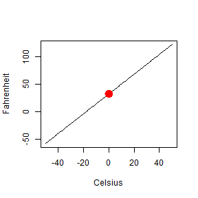

## Introduction

This project is a Celsius converter to Fahrenheit  
The points studied are the followings:  

1. Celsius definition  
2. Fahrenheit definition  
3. Conversion  

---

## Celsius
Celsius, also known as centigrade, is a scale and unit of measurement for temperature. 

It is named after the Swedish astronomer Anders Celsius (1701-1744), who developed a similar temperature scale. 

The degree Celsius ($^\circ$ C) can refer to a specific temperature on the Celsius scale as well as a unit to indicate a temperature interval. 

0 $^\circ$ C was defined as the freezing point of water and 100 $^\circ$ C was defined as the boiling point of water.

---

## Fahrenheit 
Fahrenheit (symbol $^\circ$ F) is a temperature scale based on one proposed in 1724  
by the German physicist Daniel Gabriel.   

The Fahrenheit scale was the primary temperature standard for climatic, 
industrial and medical purposes in English-speaking countries.
 
In the late 1960s and 1970s, the Celsius scale replaced Fahrenheit 
in almost all of those countries with the notable exception of the United States. 

---

## Conversion
Celsius to Fahrenheit : ($^\circ$ C x 1.8) + 32 =$^\circ$ F  

```r
Celsius<-c(-50:50)
Fahrenheit <- Celsius * 1.8 + 32
plot(Celsius, Fahrenheit, type="l")
      points(x = 0, y=32, lwd= 8, col= "red")
```

 
